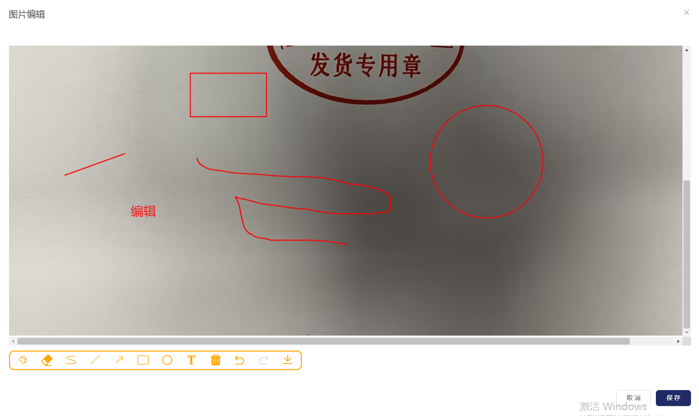

# vue-canvas-element-dialog
vue2封装的canvas图片编辑组件，需要配合element-ui使用
## 安装
```
npm i vue-canvas-element-dialog
```

### 使用
```
import vueCanvasElementDialog from 'vue-canvas-element-dialog';

import 'vue-canvas-element-dialog/lib/vue-canvas-element-dialog.css'

Vue.use(vueCanvasElementDialog);
```

### 1. 参数

* `img-base64`：图片的值，必须是base64;

* `dialog-height`：弹窗图片内容的高度，默认520;


### 2. 返回默认事件

* `onClose`：关闭按钮的弹窗回调;

* `onSubmit`：保存按钮的回调，会返回修改后图片的参数val;

## 示例

```
<vue-canvas-element-dialog
    v-if="urlImgBase64"
    :img-base64="urlImgBase64"
    @onClose="closeImg"
    @onSubmit="submitImg">
</vue-canvas-element-dialog>
````

## 示例图片

